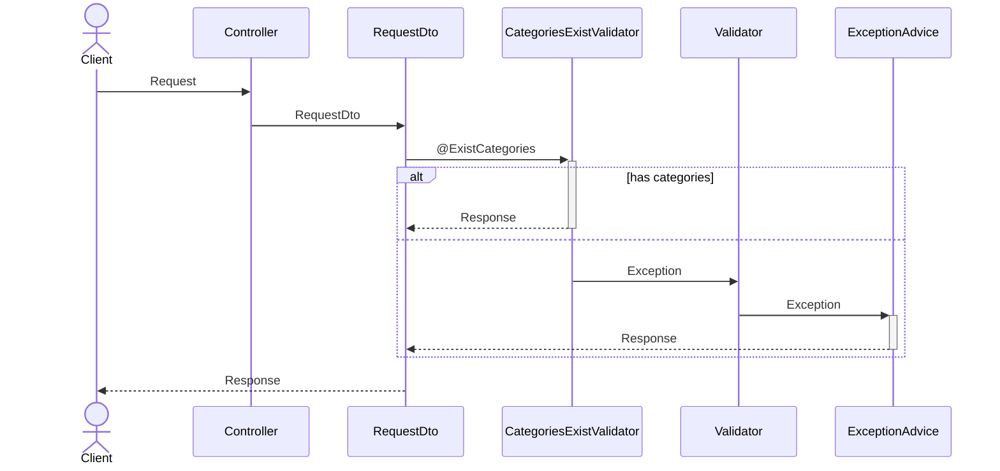

# Chapter 8. API & Swagger & Annotation (1)

# 📝 학습 목표

---

1. 이번엔 Database와 상호작용을 하는 API의 예시를 통해 전체적인 과정을 숙지한다.
2. Swagger의 세팅을 익힌다.
3. 어노테이션을 통한 Validation을 익힌다.

# 📸 잠깐 ! 스터디 인증샷은 찍으셨나요?📸

---

* 스터디 리더께서 대표로 매 주차마다 한 장 남겨주시면 좋겠습니다!🙆💗
 (사진을 저장해서 이미지 임베드를 하셔도 좋고, 복사+붙여넣기 해서 넣어주셔도 좋습니다!)

[https://www.notion.so](https://www.notion.so)

# 📑 8주차 주제

---

8주차는 7주차에 비하면 설명이 길지 않을 것입니다. 🎉🎉

~~스프링 자체 설명은 짧으나 깃허브 설명이 들가서 길어짐…~~

사실상 Springboot의 흐름은 7주차에서 많이 다뤘습니다.

8주차는 좀 더 구체적인 과정을 통해 살펴보는 그런 느낌이 주류가 될 것입니다.

거기에 Service, Controller에서 클라이언트에서 넘겨준 데이터에 대한 검증 처리를 하지 않고,

어노테이션을 통해 하게 해서 단일 책임 원칙을 지키면서도 ✨**더 코드를 멋지게 짜는 법**✨을 다뤄봅시다.

# 🔖 8주차 본문

---

이번에는 아주아주 간단하게 (~~복잡한 API는 여러분이 미션으로 해야함~~)

사용자를 생성하는(회원 가입) API를 만들면서 Database와의 상호작용까지 포함된 과정을 봅시다.

회원 가입에 필요한 스프링 시큐리티는 10주차에 설명 드릴 예정입니다.


이 화면에 해당하는 기능에 대한 API를 만들어 봅시다.

## 깃허브 이슈 & 브랜치 만들기

---

우선 이것도 **기능을 파는 것**이니 **깃허브에서 이슈를 만들고 브랜치를 만드는 것**을 해봅시다.

**이걸 굳이 왜 하느냐, 나중에 11주차에 나올 깃허브 액션을 쓰려면 알아야 하기 때문입니다!**


자, 여기서 뭐를 할 것이냐, **이슈를 만들 것**입니다.


일단 이슈를 만들기 전에 **라벨**부터 바꾸도록 합시다.


라벨을 **깃모지**를 써서 🌼예쁘게🌼 해봅시다. (싫으면 안 해도 됨)

- [참고] **깃모지(gitmoji)**란?
    
    [⚡️ Gitmoji 사용법 정리 (+ 깃모지 툴 소개)](https://inpa.tistory.com/entry/GIT-⚡️-Gitmoji-사용법-Gitmoji-cli)
    

**: (콜론)**를 쓰면 깃모지 선택이 나오니 의미에 맞는 깃모지를 써서 라벨을 꾸밉시다. (참고 자료 확인!)


> bug → **:bug: bug (= 🐛 bug)**
documentation → **:memo: docs (= 📝 docs)**
enhancement → **:sparkles: feature (= ✨ feature)**
> 

이렇게 하고 색도 연한 색으로 해서 꾸몄습니다.

이제 하나만 더 추가하죠,


**REFACTOR**에 사용될 라벨입니다

**:recycle: refactor (= ♻️ refactor)** 이렇게 해주세용


이제 이슈를 파봅시다.


저는 이슈 제목에 깃모지를 적극 활용하는 편입니다.

그리고,
**깃모지를 쓰든 안쓰든 [FEAT] [REFACTOR] [FIX] 등등 어떤 것에 대한 이슈인지는 꼭 명시**해주세요!

그리고 우측에 누구에게 할당 될 업무인지, 어떤 종류의 라벨인지 골라주세요!

이제 이슈를 생성해볼게요.


이제 저 동그라미(Create a branch)를 통해 브랜치를 만들어주세요!


브랜치 이름은 역시 프로젝트의 컨벤션마다 다 다르지만
한 가지 방법으로써 **업무종류/이슈번호**를 알려드릴게요.

위의 업무는 feature이고 이슈 번호가 3번이니, **feature/#3** 이렇게 브랜치 이름을 정하는 것입니다.


이제 위 사진의 명령어를 복사해주세요.


이제 새로운 브랜치에서 작업을 할 거에요.

❗주의할 점은, **새 브랜치가 뻗어나갈 브랜치에서 브랜치를 만들어줘야 한다는 것**입니다!

프로젝트 컨벤션마다 다 다르겠지만,

예를 들어 **main**에 구현된 기능들이 모인다면 **반드시 main에서 새 브랜치를 파는 것**이고

main은 최종 배포용으로 사용하고, **develop**에 개발 완료가 된 기능들이 모인다면, **develop에서 새 브랜치를 파는 것**입니다.

이렇게 프로젝트마다 다르니 참고해주세요.

저는 그냥 main에서 브랜치를 파도록 하겠습니다.

그런데, 위 사진을 보면, 현재 저는 week_8 브랜치죠? ~~네!~~

여기서 저 명령어를 복붙해서 브랜치를 파면 안되겠죠? ~~네!~~

main 브랜치로 이동을 해줍시다.

***깃허브 명령어는 구글링을 통해 숙지해주세요!***


자, 이제 바로 깃허브에서 복사한 명령어를 넣어서 브랜치를 팔까요?

**아니죠,** 내가 어떤 브랜치에서 작업을 하는 동안 main에 새로 머지가 되었을 수도 있으니,
먼저 git pull origin main으로 main 브랜치의 변경 사항을 가져와야 합니다.

위에 설명한 것처럼 **브랜치를 파기 전 브랜치를 파고자 하는 곳의 변경 사항을 가져온 후,
새 브랜치를 파야**합니다!

이제 API를 만들어봅시다!

## API 만들기 (회원 가입 API)

---

7주차에서 했던 순서대로 만들면 됩니다. 따라서 상세한 설명은 생략하고 진행하겠습니다.

**API URL은 예시일 뿐, 미션 때는 여러분들이 3주차에서 설계한 URL을 사용하셔야 합니다!**

1. **DTO 생성**
    
    ```java
    public class MemberRequestDTO {
    		
    		@Getter
        public static class JoinDto{
            String name;
            Integer gender;
            Integer birthYear;
            Integer birthMonth;
            Integer birthDay;
            String address;
            String specAddress;
            List<Long> preferCategory;
        }
    }
    ```
    
    ```java
    
    public class MemberResponseDTO {
    
        @Builder
        @Getter
        @NoArgsConstructor
        @AllArgsConstructor
        public static class JoinResultDTO{
            Long memberId;
            LocalDateTime createdAt;
        }
    }
    ```
    

1. **Converter 생성**
    
    ```java
    public class MemberConverter {
    
        public static MemberResponseDTO.JoinResultDTO toJoinResultDTO(Member member){
            return MemberResponseDTO.JoinResultDTO.builder()
                    .memberId(member.getId())
                    .createdAt(LocalDateTime.now())
                    .build();
        }
    }
    ```
    

1. **Controller 생성**
    
    ```java
    @RestController
    @RequiredArgsConstructor
    @RequestMapping("/members")
    public class MemberRestController {
    
        private final MemberCommandService memberCommandService;
    
        @PostMapping("/")
        public ApiResponse<MemberResponseDTO.JoinResultDTO> join(@RequestBody @Valid MemberRequestDTO.JoinDto request){
            return null;
        }
    }
    ```
    
2. **Service 생성**
    
    
    

1. **Repository 생성**
    
    
    
    Spring Data JPA를 사용할 것이기에 인터페이스로 만들어줍니다.
    
    ```java
    public interface MemberRepository extends JpaRepository<Member, Long> {
    }
    ```
    

1. **Service 완성? (No)**
    
    ```java
    @Service
    @RequiredArgsConstructor
    public class MemberCommandServiceImpl implements MemberCommandService{
        
        private final MemberRepository memberRepository;
        
        @Override
        public Member joinMember(MemberRequestDTO.JoinDto request) {
            
            return null;
        }
    }
    ```
    
    Member 객체를 만드는 작업 (클라이언트가 준 DTO to Entity)를 서비스 단에서 할까요?
    
    프로젝트마다 다릅니다.
    
    저의 경우 서비스는 오로지 비즈니스 로직에만 집중을 합니다. 따라서 Member를 만드는 작업을 converter에서 하겠습니다.
    
2. **Converter에서 멤버 생성**
    
    ```java
    public class MemberConverter {
    
        public static MemberResponseDTO.JoinResultDTO toJoinResultDTO(Member member){
            return MemberResponseDTO.JoinResultDTO.builder()
                    .memberId(member.getId())
                    .createdAt(LocalDateTime.now())
                    .build();
        }
    
        public static Member toMember(MemberRequestDTO.JoinDto request){
    
            Gender gender = null;
    
            switch (request.getGender()){
                case 1:
                    gender = Gender.MALE;
                    break;
                case 2:
                    gender = Gender.FEMALE;
                    break;
                case 3:
                    gender = Gender.NONE;
                    break;
            }
    
            return Member.builder()
                    .address(request.getAddress())
                    .specAddress(request.getSpecAddress())
                    .gender(gender)
                    .name(request.getName())
                    .memberPreferList(new ArrayList<>())
                    .build();
        }
    }
    ```
    
    ***저는 여기서, 멤버 엔티티에 나이를 넣지 않음을 깨달았습니다 🙂***
    
    그냥.. 진행 하겠습니다. 여러분들은 원하시면 엔티티에 추가하시면 됩니다!
    
    ```java
    .memberPreferList(new ArrayList<>())
    ```
    
    그리고 리스트는 ***new ArrayList<>()  ←*** 요렇게 ****초기화를 해줘야 합니다!
    
    
    
    그리고 원래 이메일을 소셜 로그인에서 처리 한 후, 나머지 정보를 기입 받는 것이 맞는 순서이나, **소셜 로그인 없이 하는 중**이라 **이메일은 nullable로 바꾸고 진행**하겠습니다.
    
    application.yml에서 
    
    create로 테이블을 다시 만들고 진행해주세요!
    
    
    
    ### 🤔 유저 선호 음식 카테고리는?
    
    이런 경우 따로 처리를 해야 하니 우선 서비스를 이어서 작성을 해봅시다.
    
3. **Service 중간 완성**
    
    ```java
    @Service
    @RequiredArgsConstructor
    public class MemberCommandServiceImpl implements MemberCommandService{
    
        private final MemberRepository memberRepository;
    
        @Override
        public Member joinMember(MemberRequestDTO.JoinDto request) {
    
            Member newMember = MemberConverter.toMember(request);
            
            return null;
        }
    }
    ```
    
    자, 이제 유저가 선호하는 카테고리를 처리해야 합니다.
    
    제가 **RequestDTO**에서 **List<Long>**으로 선호 카테고리를 받았잖아요?
    
    ```java
    @Getter
    public static classJoinDto{
        String name;
        Integer gender;
        Integer birthYear;
        Integer birthMonth;
        Integer birthDay;
        String address;
        String specAddress;
    		List<Long> preferCategory;
    }
    ```
    
    이것은 사실 
    
    <aside>
    🤗 아래 화면에서 **우측 화면 렌더링 시 음식 카테고리를 조회하는 API를 호출하고,
    그 API의 결과에서 음식 카테고리의 id값을 프론트엔드가 넘겨준다는 것을 전제로 한 것**입니다!
    
    </aside>
    
    
    
    따라서 DB에서 일단 저 카테고리들을 만들어둡시다.
    
    
    
4. **음식 카테고리 Repository 생성**
    
    ```java
    public interface FoodCategoryRepository extends JpaRepository<FoodCategory, Long> {
    }
    ```
    
5. **Service 이어서 작성**
    
    ```java
    @Service
    @RequiredArgsConstructor
    public class MemberCommandServiceImpl implements MemberCommandService{
    
        private final MemberRepository memberRepository;
    
        private final FoodCategoryRepository foodCategoryRepository;
    
        @Override
        @Transactional
        public Member joinMember(MemberRequestDTO.JoinDto request) {
    
            Member newMember = MemberConverter.toMember(request);
            List<FoodCategory> foodCategoryList = request.getPreferCategory().stream()
                    .map(category -> {
                        return foodCategoryRepository.findById(category).orElseThrow(() -> new FoodCategoryHandler(ErrorStatus.FOOD_CATEGORY_NOT_FOUND));
                    }).collect(Collectors.toList());
    
            List<MemberPrefer> memberPreferList = MemberPreferConverter.toMemberPreferList(foodCategoryList);
    
            memberPreferList.forEach(memberPrefer -> {memberPrefer.setMember(newMember);});
    
            return memberRepository.save(newMember);
        }
    }
    ```
    
    여기서 stream을 사용했는데요, 저는 for문 보다는 stream을 사용 할 것을 **강력히 권고합니다.**
    
    **stream을 처음 보신다면 구글링을 통해 stream을 어떻게 사용하는지 숙지해주세요.**
    
    그리고 위의 코드를 보면 뭐가 보이나요?
    
    ```java
    () -> new FoodCategoryHandler(ErrorStatus.FOOD_CATEGORY_NOT_FOUND)
    ```
    
    네, **FoodCategoryHandler**가 추가가 되었죠?
    
    여러분들이 **직접** 추가를 하고 따라와 주세요. (ErrorStatus의 FOOD_CATEGORY_NOT_FOUND도 추가해주세요!)
    
    이제 FoodCategory의 리스트를 얻었으니 이를 이용해 MemberPrefer 엔티티를 만들어 줍시다.
    
    역시 converter에서 하겠죠?
    
    ```java
    public class MemberPreferConverter {
    
        public static List<MemberPrefer> toMemberPreferList(List<FoodCategory> foodCategoryList){
    
            return foodCategoryList.stream()
                    .map(foodCategory ->
                            MemberPrefer.builder()
                                    .foodCategory(foodCategory)
                                    .build()
                    ).collect(Collectors.toList());
        }
    }
    
    ```
    
    양방향 연관 관계 설정은 converter 보다는 service에서 하는 것이 좋습니다!
    
    단방향은 컨버터에서 설정을 해도 괜찮습니다.
    
    따라서 MemberPrefer 생성 시 member를 넣지 않았습니다.
    
6. **Service 완성**
    
    이제 서비스에서 뭘 해야 할까요?
    
    연관 관계를 설정하고, 양방향 매핑이 된 경우 연관 관계 편의 매서드를 이용해 양방향 매핑을 해줍니다.
    
    참고로, 제가 사용하는 연관 관계 편의 매서드는 아래와 같은 모양을 가집니다.
    
    ```java
    @Entity
    @Getter
    @Builder
    @NoArgsConstructor(access = AccessLevel.PROTECTED)
    @AllArgsConstructor
    public class MemberPrefer extends BaseEntity {
    
        @Id
        @GeneratedValue(strategy = GenerationType.IDENTITY)
        private Long id;
    
        @ManyToOne(fetch = FetchType.LAZY)
        @JoinColumn(name = "member_id")
        private Member member;
    
        @ManyToOne(fetch = FetchType.LAZY)
        @JoinColumn(name = "category_id")
        private FoodCategory foodCategory;
    
        public void setMember(Member member){
            if(this.member != null)
                member.getMemberPreferList().remove(this);
            this.member = member;
            member.getMemberPreferList().add(this);
        }
        
        public void setFoodCategory(FoodCategory foodCategory){
            this.foodCategory = foodCategory;
        }
    }
    ```
    
    **이제 완성된 service의 코드는 아래와 같습니다.**
    
    ```java
    @Service
    @RequiredArgsConstructor
    public class MemberCommandServiceImpl implements MemberCommandService{
    
        private final MemberRepository memberRepository;
    
        private final FoodCategoryRepository foodCategoryRepository;
    
        @Override
        @Transactional
        public Member joinMember(MemberRequestDTO.JoinDto request) {
    
            Member newMember = MemberConverter.toMember(request);
            List<FoodCategory> foodCategoryList = request.getPreferCategory().stream()
                    .map(category -> {
                        return foodCategoryRepository.findById(category).orElseThrow(() -> new FoodCategoryHandler(ErrorStatus.FOOD_CATEGORY_NOT_FOUND));
                    }).collect(Collectors.toList());
    
            List<MemberPrefer> memberPreferList = MemberPreferConverter.toMemberPreferList(foodCategoryList);
    
            memberPreferList.forEach(memberPrefer -> {memberPrefer.setMember(newMember);});
    
            return memberRepository.save(newMember);
        }
    }
    ```
    
    ***@Transactional을 통해 트랜잭션을 설정해줍니다.***
    
    이 어노테이션이 무엇인지, 어떤 역할을 하는지 궁금하다면 구글링을 해서 찾아보세요!
    
7. **controller 완성**
    
    ```java
    @RestController
    @RequiredArgsConstructor
    @RequestMapping("/members")
    public class MemberRestController {
    
        private final MemberCommandService memberCommandService;
    
        @PostMapping("/")
        public ApiResponse<MemberResponseDTO.JoinResultDTO> join(@RequestBody @Valid MemberRequestDTO.JoinDto request){
            Member member = memberCommandService.joinMember(request);
            return ApiResponse.onSuccess(MemberConverter.toJoinResultDTO(member));
        }
    }
    ```
    
    ***@Valid는 뭐지? ← 이건 뒤에서 나옵니다..***
    
    ### 🤔 근데 이제 테스트… 어떻게 하지?
    
    POST 요청이기에 냅다 url만 입력한다고 테스트가 되지는 않습니다…
    
    그러면 어떻게 테스트를 할까요? POSTMAN이라는 툴이 유명하죠.
    
    그러나 우린 Swagger라는 매우 편리하고 좋은 툴을 사용 할 것입니다.
    
    ~~물론… 코딩을 더 해야하지만…~~
    

## Swagger 세팅

---

우선 스웨거를 쓰려면 추가적인 의존성이 필요합니다.


```
implementation 'org.springdoc:springdoc-openapi-starter-webmvc-ui:2.3.0'
```

이후 config 패키지를 만들어주세요

**해당 패키지에는 추후 S3 관련 Config도 들어갑니다!**


```java
@Configuration
public class SwaggerConfig {

    @Bean
    public OpenAPI UMCstudyAPI() {
        Info info = new Info()
                .title("UMC Server WorkBook API")
                .description("UMC Server WorkBook API 명세서")
                .version("1.0.0");

        String jwtSchemeName = "JWT TOKEN";
        // API 요청헤더에 인증정보 포함
        SecurityRequirement securityRequirement = new SecurityRequirement().addList(jwtSchemeName);
        // SecuritySchemes 등록
        Components components = new Components()
                .addSecuritySchemes(jwtSchemeName, new SecurityScheme()
                        .name(jwtSchemeName)
                        .type(SecurityScheme.Type.HTTP) // HTTP 방식
                        .scheme("bearer")
                        .bearerFormat("JWT"));

        return new OpenAPI()
                .addServersItem(new Server().url("/"))
                .info(info)
                .addSecurityItem(securityRequirement)
                .components(components);
    }
}
```

Swagger 세팅에 대한 자세한 내용은 역시 구글링을 해서 찾아보시기 바랍니다.

이제  [http://localhost:8080/swagger-ui/index.html#/](http://localhost:8080/swagger-ui/index.html#/) 로 접속을 해봅시다!

그러면 아래와 같은 화면이 보이게 됩니다.


이제 방금 만든 API를 테스트 해봅시다.

아래와 같이 응답이 오는 것을 확인 할 수 있습니다.


### 😱 그런데, status가 null이네요, 분명 default 설정을 했는데..

이것은 JPA가 save로 데이터베이스에 저장 할 때, null인 값에 대해 그냥 null을 insert 해버려서 생기는 문제입니다.

이를 막기 위해 Member Entity를 아래처럼 수정해주세요.

```java
@Entity
@Getter
**@DynamicUpdate
@DynamicInsert**
@Builder
@NoArgsConstructor(access = AccessLevel.PROTECTED)
@AllArgsConstructor
public class Member extends BaseEntity {

    @Id
    @GeneratedValue(strategy = GenerationType.IDENTITY)
    private Long id;

    @Column(nullable = false, length = 20)
    private String name;

    @Column(nullable = false, length = 40)
    private String address;

    @Column(nullable = false, length = 40)
    private String specAddress;

    @Enumerated(EnumType.STRING)
    @Column(columnDefinition = "VARCHAR(10)")
    private Gender gender;

    @Enumerated(EnumType.STRING)
    private SocialType socialType;

    @Enumerated(EnumType.STRING)
    @Column(columnDefinition = "VARCHAR(15) DEFAULT 'ACTIVE'")
    private MemberStatus status;

    private LocalDate inactiveDate;

//    @Column(nullable = false, length = 50)
    private String email;

    @ColumnDefault("0")
    private Integer point;

    @OneToMany(mappedBy = "member", cascade = CascadeType.ALL)
    private List<MemberAgree> memberAgreeList = new ArrayList<>();

    @OneToMany(mappedBy = "member", cascade = CascadeType.ALL)
    private List<MemberPrefer> memberPreferList = new ArrayList<>();

    @OneToMany(mappedBy = "member", cascade = CascadeType.ALL)
    private List<Review> reviewList = new ArrayList<>();

    @OneToMany(mappedBy = "member", cascade = CascadeType.ALL)
    private List<MemberMission> memberMissionList = new ArrayList<>();
}
```

**@DynamicUpdate
@DynamicInsert**

이 두 개는 insert와 update 시 null 인 경우는 그냥 쿼리를 보내지 않도록 해줍니다.

그리고 

@ColumnDefault("0")
private Integer point;

포인트도 원래 디폴트가 0이어야 하는데 깜빡해서 여기서 넣었습니다 😇

이제 다시 테스트를 해봅시다.


이제 Default 값도 잘 들어가는 것을 확인 할 수 있습니다!

## *fin*. 어노테이션을 활용한 validation

---

service 함수를 보면 어떻게 되어있나요?


서비스 단에서 validation을 하고 있는 것을 확인 할 수 있습니다.

이를 @을 이용해 더 좋은 방식으로 리팩토링이 가능합니다.


위 사진처럼 패키지를 만들어 주세요

이제 어노테이션을 만들어서 category가 데이터베이스에 존재하는지 검증하도록 하겠습니다.

우선 build.gradle에 새로운 의존성을 추가해주세요.


```
implementation 'org.springframework.boot:spring-boot-starter-validation'
```


ExistCategories

```java
@Documented
@Constraint(validatedBy = CategoriesExistValidator.class)
@Target( { ElementType.METHOD, ElementType.FIELD, ElementType.PARAMETER })
@Retention(RetentionPolicy.RUNTIME)
public @interface ExistCategories {

    String message() default "해당하는 카테고리가 존재하지 않습니다.";
    Class<?>[] groups() default {};
    Class<? extends Payload>[] payload() default {};
}
```

<aside>
🌟 **@Documented** - ****이 어노테이션은 사용자 정의 어노테이션을 만들 때 붙입니다.

**@Target** - ****이 어노테이션은 어노테이션의 적용 범위를 지정합니다. 각 파라미터의 자세한 역할은 구글링을 해서 찾아보세용.

**@Retention** - ****이 어노테이션은 어노테이션의 생명 주기를 지정합니다. 위의 코드는 RUNTIME이기에 실행 하는 동안에만 유효하게 됩니다.

</aside>

마지막으로,

**@Constraint** 이 어노테이션은 


사진을 보면 알겠지만, java에서 제공하는 사용자가 validation을 커스텀 어노테이션을 통해 할 수 있도록 제공하는 어노테이션입니다.

**@Constraint**의 ****파라미터로 validatedBy가 있고 CategoriesExistValidator.class를 지정하고 있죠.

이로써 CategoriesExistValidator라는 클래스를 통해 @ExistCategories가 붙은 대상을 검증합니다.

그러면 CategoriesExistValidator 내부를 봐야겠죠?


우선 ConstraintValidator 인터페이스에 대한 구체화 클래스로서 만들어야 합니다.

이때, ExistCategories 어노테이션에 대한 로직을 담을 것이며 검증 대상이 List<Long>임을 명시하죠.

아래 사진을 봅시다.


이렇게 클래스를 만들기만 하면 자동으로 빨간줄이 생깁니다.

이는 인터페이스를 구현하려면 메소드를 오버라이딩 해야하는데 그게 없다는 의미입니다.

위 사진처럼 빨간줄이 생기는 곳 적당한 곳에 마우스 커서를 올리면 아래에

implement methods라고 보일 것입니다. (단축키도 있으나 윈도우와 맥이 달라서…..)

이제 저걸 클릭하면 


이렇게 어떤 메소드를 오버라이딩 할 것인지 물어보는데, 그냥 전부 다 선택 후 확인을 해주세요.


그러면 위와 같이 세팅이 되는데 우리는 isValid 메소드만 우리가 원하는 형태로 바꾸면 됩니당!

```java
@Component
@RequiredArgsConstructor
public class CategoriesExistValidator implements ConstraintValidator<ExistCategories, List<Long>> {

    private final FoodCategoryRepository foodCategoryRepository;

    @Override
    public void initialize(ExistCategories constraintAnnotation) {
        ConstraintValidator.super.initialize(constraintAnnotation);
    }

    @Override
    public boolean isValid(List<Long> values, ConstraintValidatorContext context) {
        boolean isValid = values.stream()
                .allMatch(value -> foodCategoryRepository.existsById(value));

        if (!isValid) {
            context.disableDefaultConstraintViolation();
            context.buildConstraintViolationWithTemplate(ErrorStatus.FOOD_CATEGORY_NOT_FOUND.toString()).addConstraintViolation();
        }

        return isValid;

    }
}
```

위의 코드를 보면 isValid함수에서 검증 대상인 List<Long> 의 값을 가진 카테고리가 모두 데이터베이스에 있는 지를 판단하고 없을 경우 false를 반환합니다.

이제 일단 스웨거에서 테스트를 해보죠.


우선 Http status로 400이 왔고, error임에도 result에 값이 들어가 있습니다.

***이 때, request body 중 어디를 잘못 했는지를 알려주고 있습니다.***

사실 위의 방식은 프론트 개발자를 배려해서 응답을 결정 한 것입니다.

그러면 어떻게 위의 응답이 오게 되었는지 알아봅시다.

우선,


이 `*ConstraintValidator`* 요 친구는 isValid 메소드의 반환 값을 확인하여 검증이 되었는지 실패했는 지를 알려줍니다.

만약 isValid의 리턴 값이 false면 `ConstraintViolationException` 을 발생시킵니다.

그런데 이 때, DTO를 가보면


@ExistCategories 어노테이션이 Request Body로 받아 올 Dto의 필드에 붙어있으므로


컨트롤러에서 RequestBody를 받아오는 과정에서 @ExistCategories 가 붙어있는 DTO로 인해


위의 코드가 실행이 됩니다.

이제 isValid 메소드에서 false를 리턴하면 `ConstraintViolationException` 를 발생시키는데,


@Valid 어노테이션이 존재하므로 @ExistCategories에서 발생한 예외가 바로 전달이 되지 않고, 

@Valid 어노테이션이 **MethodArgumentNotValidException를 발생시킵니다.**

따라서 최종적으로 


advice에서 **MethodArgumentNotValidException를 감지하게 됩니다.**

지금까지 이 기나긴 여정을 따라오시다 보면

**~~자결(wkruf)…..??~~**

이 생각이 드실텐데

제가 PPT로 도식화 해볼게용



```mermaid
flowchart RL
    A[Client] -- Request --> B[Controller]
    B --> ValidationCheck --> B
    subgraph ValidationCheck
        direction TB
        X[RequestDto] --> C[@ExistCategories]
        C -- isValid --> Exception -->D[CategoriesExistValidator]
        subgraph Exception
            direction TB
            D -- ConstraintViolationException --> E[@Valid]
            E -- MethodArgumentNotValidException --> F[advice]
        end
    end
    B -- Response --> A
```

1. Controller에서 클라이언트가 넘겨준 HTTP RequestBody의 데이터를 DTO로 변환함
2. 그 과정에서 @ExistCategories가 동작
3. Validator에서 isValid의 false 값을 확인하고 `ConstraintViolationException` 를 발생
4. @Valid가 있으므로 `ConstraintViolationException` 가 곧바로 전달되지 않음
5. @Valid입장에서 역시나 검증이 실패 한 것을 감지하여 `MethodArgumentNotValidException` 생성
6. 최종적으로 ExceptionAdvice가 감지 후 응답 생성


이렇게 Request Body가 아닌 PathVariable 등 다른 값에 대해서도 어노테이션을 붙일 수 있는데,

이 경우는 @Valid를 거치지 않기에 곧바로 `ConstraintViolationException` 가 전달이 됩니다.

(단, 이때는 Controller에 @Validated를 넣어주어야합니다!)

이를 이용해서 Path variable과 Query String의 값도 검증이 가능하며

**이번 주 미션에서 도전을 하셔야 합니다!**

진짜 마지막으로 (찐막!)

```java
public class MemberRequestDTO {

    @Getter
    public static class JoinDto{
        @NotBlank
        String name;
        @NotNull
        Integer gender;
        @NotNull
        Integer birthYear;
        @NotNull
        Integer birthMonth;
        @NotNull
        Integer birthDay;
        @Size(min = 5, max = 12)
        String address;
        @Size(min = 5, max = 12)
        String specAddress;
        @ExistCategories
        List<Long> preferCategory;
    }
}
```

RequestDTO에서 나머지 필드에 대한 검증 조건도 붙여봅시다.

@NotBlank, @NotNull 등등 이런 어노테이션은 java에서 제공하는 검증을 위한 어노테이션이며

@ExistCategories처럼 커스텀 어노테이션과 같이 사용이 가능합니다!

스웨거에서 테스트해보면 다음과 같이 잘 나오는 것을 볼 수 있습니다!


### 허나 아직 Validator에 수정을 하면 좋은 부분이 존재하며 이를 고치는 것을 미션에 포함을 시키겠습니다 🙂

**(힌트, repository에 접근하는 계층은 무조건 service 하나만 있어야 함)**

미션 수행 시 이 부분을 올바르게 고쳐서 진행해보세요!

```java
@Component
@RequiredArgsConstructor
public class CategoriesExistValidator implements ConstraintValidator<ExistCategories, List<Long>> {

    private final FoodCategoryRepository foodCategoryRepository;

    @Override
    public void initialize(ExistCategories constraintAnnotation) {
        ConstraintValidator.super.initialize(constraintAnnotation);
    }

    @Override
    public boolean isValid(List<Long> values, ConstraintValidatorContext context) {
        boolean isValid = values.stream()
                .allMatch(value -> foodCategoryRepository.existsById(value));

        if (!isValid) {
            context.disableDefaultConstraintViolation();
            context.buildConstraintViolationWithTemplate(ErrorStatus.FOOD_CATEGORY_NOT_FOUND.toString()).addConstraintViolation();
        }

        return isValid;

    }
}
```

# 🎯핵심 키워드

---

<aside>
💡 주요 내용들에 대해 조사해보고, 자신만의 생각을 통해 정리해보세요!
레퍼런스를 참고하여 정의, 속성, 장단점 등을 적어주셔도 됩니다.
조사는 공식 홈페이지 **Best**, 블로그(최신 날짜) **Not Bad**

</aside>

- java의 Exception 종류들
    
    ### **1. Exception의 정의**
    
    Java에서 Exception(예외)은 프로그램 실행 중 발생할 수 있는 오류를 나타내며, 프로그램 흐름을 제어하거나 중단하지 않고 처리할 수 있는 기회를 제공함.
    
    ### **2. Exception의 종류**
    
    1. **Checked Exception (체크 예외)**
        - **컴파일 시점**에 반드시 처리해야 하는 예외.
        - **`try-catch`**로 처리하거나 메서드에 **`throws`** 선언을 해야 함.
        - **주요 예:**
            - **`IOException`**: 파일 입출력 관련 오류
            - **`SQLException`**: 데이터베이스 작업 중 오류
            - **`ClassNotFoundException`**: 클래스 로드 실패
    2. **Unchecked Exception (언체크 예외)**
        - **런타임 시점**에 발생하며, 반드시 처리할 필요는 없음.
        - 개발자가 예외 처리를 놓칠 수 있으므로 주의 필요.
        - **주요 예:**
            - **`NullPointerException`**: 객체가 **`null`**일 때 접근 시 발생
            - **`ArrayIndexOutOfBoundsException`**: 배열 범위를 초과했을 때
            - **`ArithmeticException`**: 수학적 계산 오류 (예: 0으로 나눌 때)
    3. **Error (오류)**
        - 시스템 레벨의 심각한 문제로, 애플리케이션에서 복구가 불가능.
        - JVM 관련 문제로 인해 발생.
        - **주요 예:**
            - **`OutOfMemoryError`**: 메모리 부족
            - **`StackOverflowError`**: 무한 재귀 호출
            - **`LinkageError`**: 클래스 로드 시 충돌
    
    ### **3. 장단점**
    
    - **장점:**
        - 예외 처리를 통해 프로그램이 비정상 종료되지 않도록 방지.
        - 오류 상황을 명확히 정의하고 처리 가능.
    - **단점:**
        - 과도한 예외 처리는 코드 복잡도를 증가시킴.
        - 성능 저하를 초래할 수 있음 (예외 발생 시 스택 추적 비용).
- @Valid
    
    ### **1. @Valid의 정의**
    
    - **`@Valid`**는 **Java Bean Validation** 표준 API(JSR 380)를 기반으로 한 **유효성 검증 어노테이션**
    - 주로 **Spring MVC**에서 요청 데이터 유효성을 검증할 때 사용.
    
    ### **2. 사용 방법**
    
    1. **DTO 클래스**에서 유효성 조건 설정:
        - **`javax.validation.constraints`**에서 제공하는 어노테이션 활용.
            
            ```java
            public class UserRequest {
                @NotBlank
                private String name;
            
                @Email
                private String email;
            
                @Min(18)
                private int age;
            }
            
            ```
            
    2. **Controller에서 유효성 검증**:
        - **`@Valid`**를 사용하여 요청 객체를 검증.
            
            ```java
            @RestController
            public class UserController {
                @PostMapping("/users")
                public ResponseEntity<String> createUser(@Valid @RequestBody UserRequest request) {
                    return ResponseEntity.ok("User created!");
                }
            }
            
            ```
            
    3. **Validation 예외 처리**:
        - 유효성 검증 실패 시 **`MethodArgumentNotValidException`**이 발생.
        - **`@RestControllerAdvice`**를 활용해 예외 처리.
            
            ```java
            @RestControllerAdvice
            public class GlobalExceptionHandler {
            
                @ExceptionHandler(MethodArgumentNotValidException.class)
                public ResponseEntity<String> handleValidationExceptions(MethodArgumentNotValidException ex) {
                    return ResponseEntity.badRequest().body("Validation error");
                }
            }
            
            ```
            
    
    ### **3. 장단점**
    
    - **장점:**
        - 간결하고 선언적인 방식으로 유효성 검증 처리.
        - Spring과의 높은 통합성.
    - **단점:**
        - 커스텀 검증 로직이 필요한 경우 추가적인 작업 필요.
        - 학습 곡선이 있을 수 있음.

# 📢 학습 후기

---

- 이번 주차 워크북을 해결해보면서 어땠는지 회고해봅시다.
- 핵심 키워드에 대해 완벽하게 이해했는지? 혹시 이해가 안 되는 부분은 뭐였는지?

<aside>
💡

</aside>

# ⚠️ 스터디 진행 방법

---

1. 스터디를 진행하기 전, 워크북 내용들을 모두 채우고 스터디에서는 서로 모르는 내용들을 공유해주세요.
2. 미션은 워크북 내용들을 모두 완료하고 나서 스터디 전/후로 진행해보세요.
3. 다음주 스터디를 진행하기 전, 지난주 미션을 서로 공유해서 상호 피드백을 진행하시면 됩니다.

# 🔥 미션

---

### [UMC 서버 워크북 참고 자료](https://github.com/CYY1007/UMC_SERVER_WORKBOOK.git)

[GitHub - chock-cho/UMC-7th-spring-workbook at feature-week8-workbook](https://github.com/chock-cho/UMC-7th-spring-workbook/tree/feature-week8-workbook)

---

3주차에 설계한 URL(없으면 추가!)을 바탕으로 아래의 API 구현

단, 로그인 기능이 없는 관계로 리뷰를 작성하거나 미션 도전하는 유저는

**하드 코딩(그냥 무조건 디비에 있는 아무나 한명)**으로 하기!

1. 특정 지역에 가게 추가하기 API
2. **가게에 리뷰 추가하기 API**
3. 가게에 미션 추가하기 API
4. **가게의 미션을 도전 중인 미션에 추가(미션 도전하기) API**

3주차에 설계하지 않은 API URL의 경우는 설계를 복습 할 겸 해보고 진행해주세요!

반드시 인증 사진을 중간 중간 남기며, 7주차와 동일하게 github에 브랜치를 새로 만들어서 푸시하기

<aside>
📌 **조건**

1. github branch를 만들 때 issue를 만들고 branch 생성하여 진행 후 push할 것
2. controller, service, converter, dto, repository를 모두 활용할 것
3. ExceptionAdvice를 적극 활용해야하며 RequestBody에 값이 누락되거나 값이 잘못된 것을 @Valid 어노테이션으로 검증하기
4. **4번 API의 경우는 도전 하려는 미션이 이미 도전 중인지를 검증해야 하며 이를 커스텀 어노테이션을 통해 검증을 해야 함.**
5. **2번 API의 경우도 4번 API처럼 리뷰를 작성하려는 가게가 존재하는지 검증하는 커스텀 어노테이션을 사용할 것.**
</aside>

1, 2, 3 번 조건을 충족하지 않을 경우 해당 API는 미션 완료 대상에서 제외가 되며

**2, 4번 API는 필수로 구현해야 하고,**

만약 3번 API를 만들지 않을 경우 2,4번 API 만들 때 DB에 수동으로 미션 정보 기입해서 진행

위의 4개 API중 **필수 API 포함 3개 미만으로 완료 시 원 아웃 부여**

# 💪 미션 기록

---

<aside>
🍀 미션 기록의 경우, 아래 미션 기록 토글 속에 작성하시거나, 페이지를 새로 생성하여 해당 페이지에 기록하여도 좋습니다!

하지만, 결과물만 올리는 것이 아닌, **중간 과정 모두 기록하셔야 한다는 점!** 잊지 말아주세요.

</aside>

- **미션 기록**
    
    
    1. 특정 지역에 가게 추가하기 API
    2. **가게에 리뷰 추가하기 API**
    3. 가게에 미션 추가하기 API
    4. **가게의 미션을 도전 중인 미션에 추가(미션 도전하기) API**
    
    [특정 지역에 가게 추가하기 API](https://www.notion.so/API-3fc30fc1d12f4974a95d52f16fb659a6?pvs=21)
    
    [가게에 리뷰 추가하기 API](https://www.notion.so/API-a9f1e0ad9d9a43df81e0277c25d0060c?pvs=21)
    
    [가게에 미션 추가하기 API](https://www.notion.so/API-abfb02abdcfa4f54b47ffc36cd581dcc?pvs=21)
    
    [**가게의 미션을 도전 중인 미션에 추가(미션 도전하기) API**](https://www.notion.so/API-60fa864ebf1e44568d051bcaaccc48a0?pvs=21)
    
    [커스텀 어노테이션](https://www.notion.so/13901a032d6f4d5187aa0572878f6846?pvs=21)
    

> **github 링크**
> 
> 
> 

# ⚡ 트러블 슈팅

---

<aside>
💡 실습하면서 생긴 문제들에 대해서, **이슈 - 문제 - 해결** 순서로 작성해주세요.

</aside>

<aside>
💡 스스로 해결하기 어렵다면? 스터디원들에게 도움을 요청하거나 **너디너리의 지식IN 채널에 질문**해보세요!

</aside>

- ⚡이슈 작성 예시 (이슈가 생기면 아래를 복사해서 No.1, No.2, No3 … 으로 작성해서 트러블 슈팅을 꼭 해보세요!)
    
    **`이슈`**
    
    👉 앱 실행 중에 노래 다음 버튼을 누르니까 앱이 종료되었다.
    
    **`문제`**
    
    👉 노래클래스의 데이터리스트의 Size를 넘어서 NullPointException이 발생하여 앱이 종료된 것이었다. 
    
    **`해결`**
    
    👉  노래 다음 버튼을 눌렀을 때 데이터리스트의 Size를 검사해 Size보다 넘어가려고 하면 다음으로 넘어가는 메서드를 실행시키지 않고, 첫 노래로 돌아가게끔 해결
    
    **`참고레퍼런스`**
    
    - 링크
- ⚡이슈 No.1
    
    **`이슈`**
    
    👉 [트러블이 생긴 상태 작성]
    
    **`문제`**
    
    👉 [어떤 이유로 해당 이슈가 일어났는지 작성]
    
    **`해결`**
    
    👉  [해결 방법 작성]
    
    **`참고레퍼런스`**
    
    - [문제 해결 시 참고한 링크]

---

Copyright © 2023 최용욱(똘이) All rights reserved.

Copyright © 2024 김준환(제이미) All rights reserved.